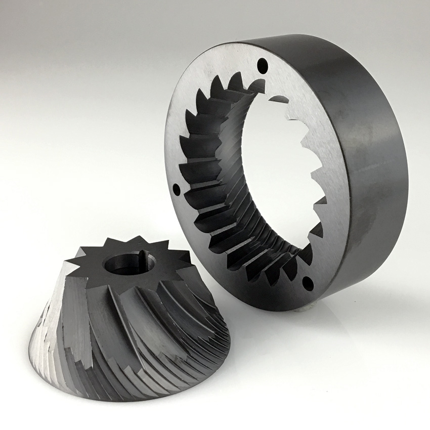

## Grinding coffee with conical burrs
Conical burrs are a popular choice in coffee grinders, particularly for hand grinders, due to their unique design and several advantages they offer over other types of grinding mechanisms. These burrs consist of a cone-shaped inner burr nested within a larger, ring-shaped outer burr. Coffee beans are fed into the top of the grinder and crushed between the two burrs, resulting in a consistent grind size.

Some examples of well known electric conical grinders are Baratza Encore, Fellow Opus, Wilfa Svart, Breville Smart Grinder Pro, Option-O lagom mini, Niche Zero, Weber Key, and Kafatek Monolith Conical.
Some examples of well known hand-cranked conical grinders are Comandante C40, Kinu M47, 1ZPresso grinders, Goat Story Arco, and Weber HG-2

Here are some reasons why conical burrs are particularly well-suited for hand grinders:

1. **Efficient Grinding at Lower RPMs:** Conical burrs can grind coffee effectively even at lower RPMs (rotations per minute). This makes them ideal for hand grinders, as users can achieve consistent and uniform grounds without needing to exert excessive force or speed during the grinding process.

2. **Consistency:** Like all burr grinders, conical burrs deliver a consistent grind size, which is crucial for optimal flavor extraction during the brewing process. The consistency is particularly important when using manual brewing methods, where the quality of the grind can have a significant impact on the taste and aroma of the final cup of coffee.

3. **Grind Size Control:** Conical burrs offer precise control over the grind size, making them suitable for various brewing methods. Hand grinders equipped with conical burrs often feature adjustable grind settings, allowing users to tailor the grind size to match their preferred brewing technique, whether it be espresso, pour-over, or French press.

4. **Less Heat Generation:** Conical burrs generally generate less heat than flat burrs during the grinding process, as their conical design allows for a more gradual reduction in bean size. This is especially beneficial in hand grinders, where friction and heat buildup can impact the flavor and aroma of the coffee. By reducing heat generation, conical burrs help preserve the delicate oils and volatile compounds in the coffee beans, contributing to a better-tasting final brew.

5. **Durability:** The conical design results in a lower grinding speed, which can reduce the wear on the burrs and prolong their lifespan. This is particularly important for hand grinders, where durability and longevity are critical factors in ensuring a reliable and consistent grinding experience over time.

In summary, conical burrs are an excellent choice for hand grinders due to their efficiency at lower RPMs, consistent grind size, precise grind size control, reduced heat generation, and durability. These attributes make hand grinders with conical burrs an ideal option for coffee enthusiasts who value quality and consistency in their brewing process.

