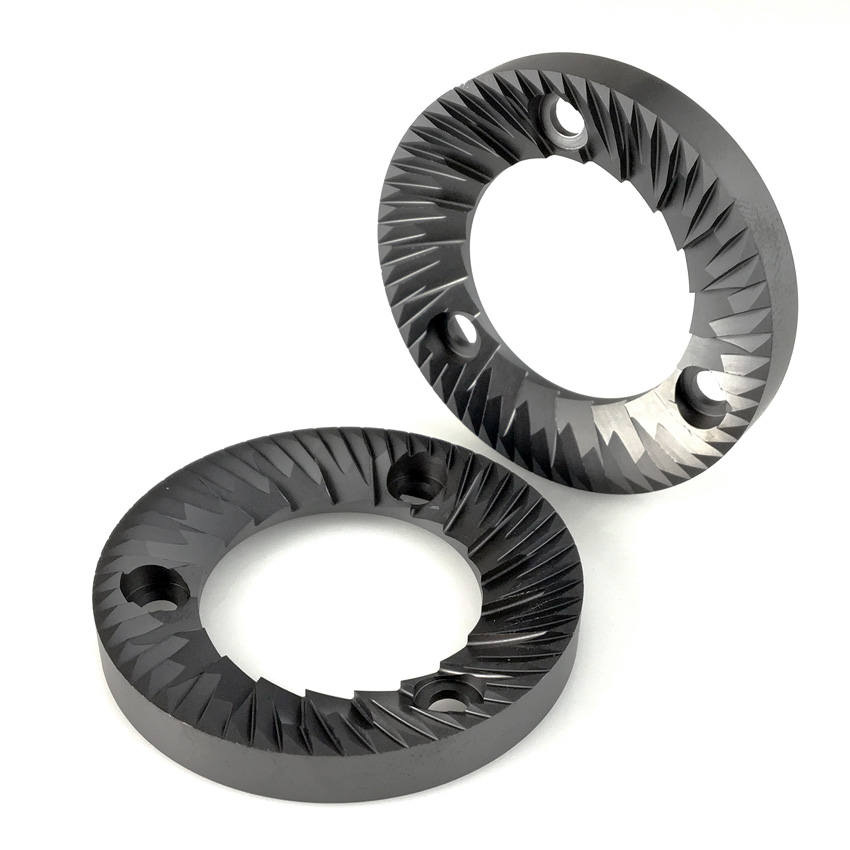

## Grinding coffee with flat burrs
Flat burrs are a type of grinding mechanism used in coffee grinders, characterized by two parallel, flat, abrasive surfaces (burrs) that face each other. Coffee beans are fed between the burrs and crushed to a consistent particle size. Flat burrs are especially suitable for electric grinders due to their unique design and several advantages they offer.

There are plenty of well known electric flat burr grinders e.g. Fellow Ode, Wilfa Uniform, Timemore Sculptor 64(s) & 78(s), Eureka Mignon Atom, Mazzer SJ & ZM, Bentwood Vertical 63, Option-O Lagom P64 & P100, Mahlkönig X54 & EK(K)43(S), Weber EG-1, Ceado Hero, Titus Nautilus & Nimbus, and Kafatek Monolith & Monolith Max.
There are only two known examples of hand-cranked flat burr grinders are Pietro and Bonafabrica hand grinders.

Here's why flat burrs are good for electric grinders:

1. **Consistency:** Flat burrs deliver a consistent and uniform grind size, which is essential for optimal flavor extraction during the brewing process. Electric grinders equipped with flat burrs can provide a precise and even grind, ensuring a well-balanced and flavorful cup of coffee.

2. **Grind Size Control:** Flat burr grinders offer precise control over the grind size, making them suitable for various brewing methods. Electric grinders with flat burrs often feature adjustable grind settings, allowing users to customize the grind size to match their preferred brewing technique, from espresso to pour-over or French press.

3. **Efficient Grinding at Higher RPMs:** Flat burrs can grind coffee effectively at higher RPMs (rotations per minute), which is a common characteristic of electric grinders. The powerful motors in electric grinders can generate the necessary speed to ensure quick and efficient grinding, resulting in a fresh and aromatic cup of coffee. Flat burrs tend to choke (stall) on lower RPMs.

4. **Particle Size Uniformity:** Flat burrs excel at producing uniform coffee grounds with minimal fines (tiny coffee particles). This uniformity can result in a more even extraction during the brewing process, which can enhance the clarity of flavors and reduce bitterness in the final cup of coffee.

5. **Durability:** Flat burrs are built to withstand the higher RPMs generated by electric grinders, ensuring a reliable and consistent grinding experience over time. Their sturdy construction and high-quality materials make them an ideal choice for electric grinders, where durability is a crucial factor.

In summary, flat burrs are an excellent choice for electric grinders due to their consistent grind size, precise grind size control, efficient grinding at higher RPMs, particle size uniformity, and durability. These attributes make electric grinders with flat burrs an ideal option for coffee enthusiasts who value quality, efficiency, and consistency in their brewing process.

